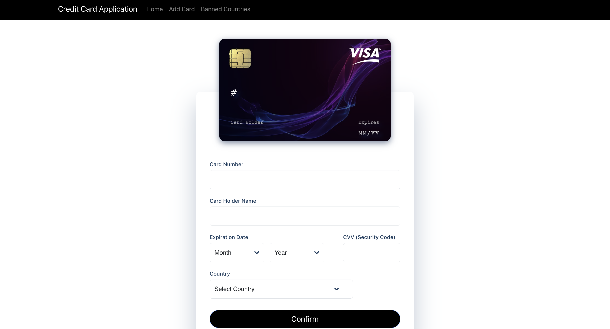
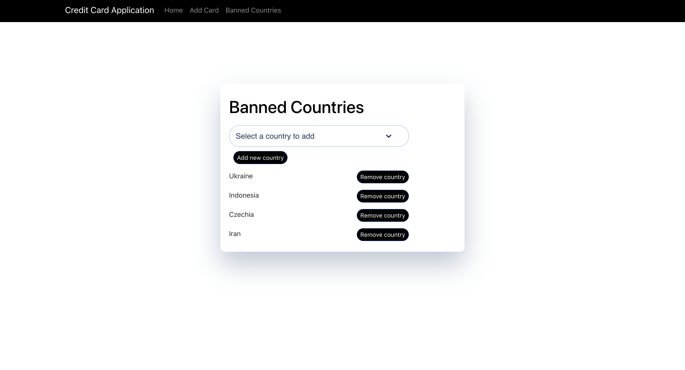
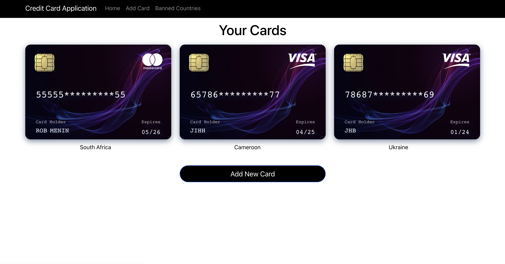
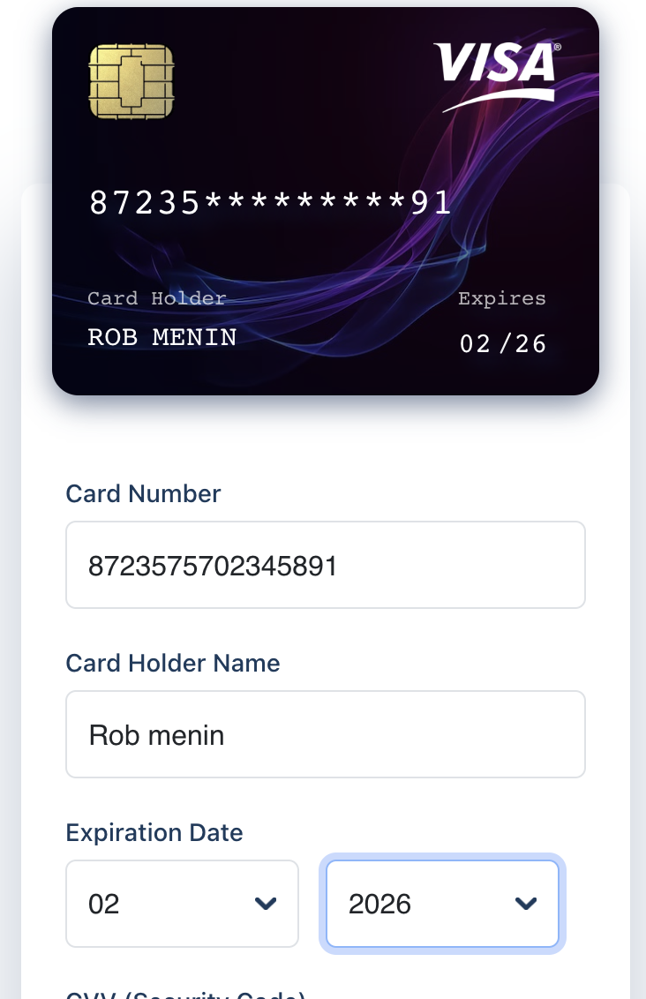
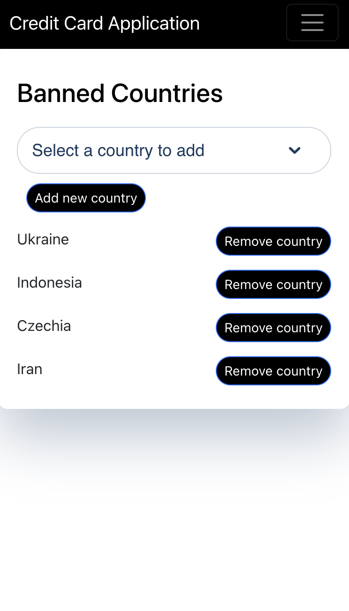
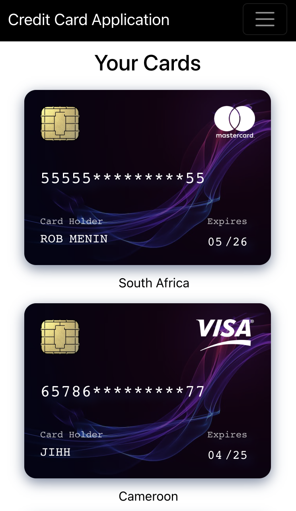

# Credit Card Payment System

A Credit Card validator system - built with react, typescript, bootstrap, sass, react-transition, font-awesome

## Screenshots

### Live site

`https://rank-assessment.vercel.app/`

### Installation

To run the Credit Card application, follow these steps:

Clone the repository: git clone `https://github.com/RobMenin/rank-assessment.git`

Navigate to the project directory: cd rank-assessment

Install the dependencies: `npm install`

Start the development server: `npm start`

Open a web browser and visit http://localhost:3000
